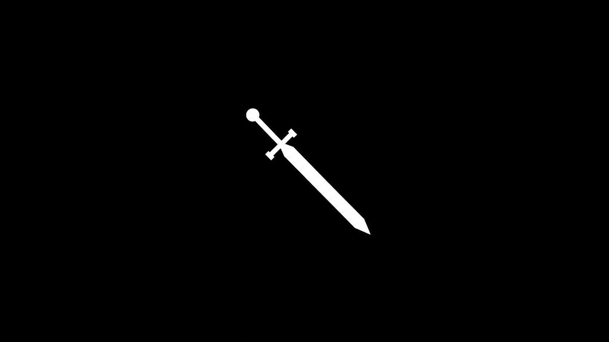

# xArmory // xCalibur

Remember when Kaggle wasn't pay to win?

Don't worry, I gotchu.

xCalibur is an effort to level the playing field by co-designing GPU kernels for the NVIDIA L4. The goal: make inference and training as fast as the hardware allows, so you can do more with the compute you've got.

First up: [Supersonic MoE](xcalibur/supersonic/README.md), built around [ARC Prize 2026](https://www.kaggle.com/competitions/arc-prize-2026-arc-agi-2)'s 4×L4 setup. Kernel details, layouts and co-design notes live there.

Jokes aside, it's still a work in progress. Small kernel tests pass on the L4; full model validation and performance work are still ahead.

## Try it

L4 / SM89, CUDA PyTorch, and a matching CUDA toolkit (`nvcc`) installed:

```bash
python -m pip install --no-build-isolation -e '.[test]'
python -m pytest -q tests
```

Offline on Kaggle, use `--no-deps -e .` instead of `-e '.[test]'` with dependencies already installed.

```python
from xcalibur import topk, pack_w13, xR38F1

routes = topk(logits, K=4, softmax=True)
W13 = pack_w13(gate, up)
Y = xR38F1(W13, X, routes)
```

Forward only for now. [Tensor contracts and tests](tests/README.md).

[Follow the discussion on Kaggle](https://www.kaggle.com/competitions/arc-prize-2026-arc-agi-2/discussion/744237).

Let's get your Sol back.
